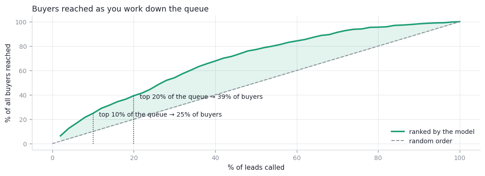
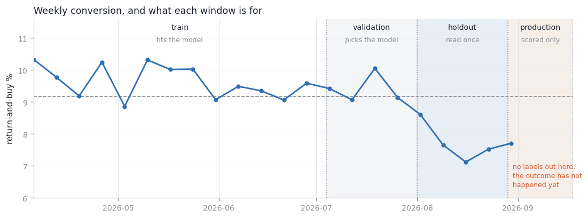
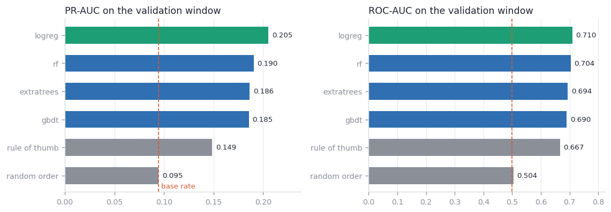
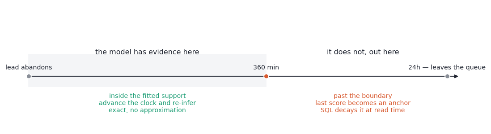
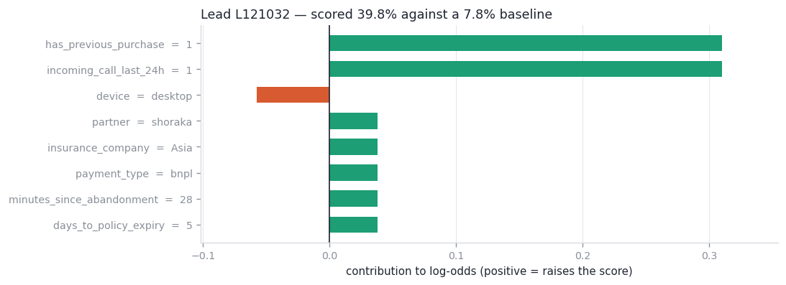

# Lead Priority Engine

Fifty thousand people reached a price and left. The telesales floor can call a few
hundred. This decides the order.

Postgres · FastAPI · scikit-learn · React, all under `docker compose`.

---

## Run it

You need Docker. Nothing else.

```bash
cp /path/to/leads.csv data/leads.csv    # not committed: the repo carries code, not data
cp .env.example .env
docker compose up --build
```

**Panel → http://localhost:8080 · API → http://localhost:8001/docs**

First boot takes ~2 minutes. `postgres` creates the schema, `bootstrap` loads the CSV and
exits, `worker` trains and scores, then `api` and `frontend` come up. If the CSV is
missing, bootstrap fails immediately with a clear message rather than leaving you an empty
dashboard. Host ports live in `.env` (`API_PORT_HOST`, `PANEL_PORT_HOST`,
`POSTGRES_PORT_HOST`).

```bash
docker compose run --rm cli train        # temporal split, train, evaluate, register
docker compose run --rm cli predict      # score leads whose age has moved
docker compose run --rm cli evaluate     # metrics for the active model
docker compose run --rm tests            # pytest
```

---

## What it delivers

**3× more buyers in the same number of calls.** Working the ranked list top-down, the
first 250 calls convert at 24.4% against a 7.4% base rate.



| Calls made | Precision | Buyers caught | Lift |
|---:|---:|---:|---:|
| 250 | 24.4% | 8.8% | **3.31×** |
| 500 | 21.2% | 15.3% | 2.87× |
| 1,000 | 18.4% | 26.6% | 2.49× |
| 2,500 | 13.6% | 49.3% | 1.85× |

Measured on the holdout — the newest 28 days, scored once, after the algorithm was already
fixed. PR-AUC 0.157 against 0.112 for a hand-written rule; ROC-AUC 0.700; Brier 0.067
after isotonic calibration, from 0.221 before.

ROC-AUC ~0.70 is the honest ceiling here, and that is the good news: no feature shows an
implausible lift, so there is nothing to leak. The model's job is to accumulate weak
signals, not to exploit one strong one.

---

## How it decides

### It is a ranking problem, not a classification problem

Capacity is fixed, so the metric is precision and lift at realistic call volumes. At a
7.4% base rate, predicting "nobody buys" is >92% accurate and worthless.

And the queue ranks **expected value**, not probability: `decayed_probability ×
expected_margin`. Margin differs ~1.5× across products, so a slightly colder lead on a
bigger policy can outrank a warmer one — deliberately.

### The split is temporal, and three-way

Conversion sits near 9.5% for four months, then drops to 7.4% and stays there. A random
split blends the two regimes and reports a score the model cannot reproduce.



The middle window picks the algorithm; the newest is read exactly once, afterwards.
Choosing on the window you then quote is selection-on-test — small with few candidates,
but it is the structure that leaks, not the count.

The inputs themselves do not move: every column stays inside its own sampling-noise floor
across all five months. What changed is the conversion rate inside an unchanged
population — so retraining cannot recover the level, only recalibration can.

### Four model families were compared; one is in production



The linear model wins by ~8%, and not because the others were under-tuned: a 20-point
sweep over leaf size and feature sampling left the whole bagged-tree family between 0.18
and 0.19. It follows from the EDA — the strongest pairwise association in the data is 0.25
and the strongest separation from the target is 0.22, so there are no deep interactions
for an ensemble to find, and the two that do matter (`is_expired`,
`expiry_x_abandonment`) are handed to every candidate as engineered features.

So `train.candidates` holds `[logreg]`. The comparison lives in
`notebooks/03_model_selection.ipynb` — re-open it when the data changes, and move the
config if the answer moves.

### A score has a shelf life

A lead's stored features never change, so a blanket rescore returns identical numbers.
What changes is its **age**, and that has two regimes:



- **Inside the fitted support** (age ≤ 360 min) the model saw leads of exactly that age,
  so the scoring job advances the lead's clock and **re-infers**. Exact, and finite per
  lead — the work winds itself down.
- **Past the boundary** the model has no evidence. Its last defensible answer becomes an
  anchor that `v_current_priority` decays in SQL at ×0.778/hour *when the queue is read*,
  so the ranking stays live without running the model.

The decay applies only to the time **past** the boundary — the model already priced the
age it was handed. And the queue ends at **24 hours**, measured rather than picked: carried
forward, by 19.5 hours the single best lead left is under 1%, and by 24 hours the whole
queue is under 0.5%.

### Every score opens up



Globally, permutation importance on the holdout. Per lead, one-feature ablation: set a
feature to the population reference, re-score, and the shift in log-odds is what that
lead's own value contributed. Plus a what-if curve along one feature at a time.

Deliberately **not** a Shapley value — one-at-a-time ablation cannot capture interactions,
and the calibration layer is monotone but not linear, so the parts do not sum to the whole.
That gap is reported as a `residual` rather than quietly distributed.

It earned itself immediately: it showed raw `price` carrying a large contribution,
contradicting the documented decision to use only the within-product percentile. Measured
head to head the raw column moved PR-AUC not at all, so it was removed.

### Who the leads are

Ranking says who to call first; it says nothing about *what kind* of lead that is. k-means
over the model's own feature space, k chosen by silhouette, recomputed with each model
version:

| Segment | Leads | Converts | Avg margin | Of its queued leads, we'd call |
|---|---:|---:|---:|---:|
| policy already expired | 6,991 | 13.2% | 281K | 18% |
| reached the offer page | 23,744 | 12.1% | 338K | 29% |
| average across the board | 928 | 9.6% | 351K | 38% |
| stale, far from expiry | 7,010 | 5.1% | 408K | 8% |
| never saw an offer | 11,327 | 3.1% | 400K | 7% |

The first row is the interesting one: it converts best of any group yet takes fewer calls
than the offer-page group, because it carries the *lowest* margin. That is expected-value
ranking working as intended — ranking on probability alone would invert the two.

---

## What a lead record actually is

The task statement doesn't say what creates a `lead` row, and several columns disagree
about it. One reading survives every piece of evidence
(`notebooks/02_record_generation.ipynb` works through it):

> **A row is a snapshot of a priced quote, written by a scheduled job.** `created_at` is
> when the job wrote it — seconds always `00`, flat by hour and weekday, correlated with
> nothing. `minutes_since_abandonment` is the lead's age at capture, right-censored at 360
> minutes, and **frozen**: the 180 duplicated `lead_id`s differ only in the write stamp,
> 1–14 minutes apart, and the age is identical across that gap. `completed_purchase` was
> backfilled afterwards.

That one reading fixes the whole serving path — at inference a lead's age is
`minutes_since_abandonment + (now − created_at)`, capped at the boundary — and it settles
the smaller decisions too:

- **`completed_purchase` is a *later* purchase, not this session's.** 517 leads bought
  without ever reaching the offer page — through a renewal link or an agent on the phone,
  a channel the row does not describe. So the queue ranks who will buy next, not who was
  about to click, and a fresh row's outcome is not final yet.
- **`visited_offer_page` is funnel depth, not a precondition.** Among non-visitors a prior
  purchase or an inbound call each roughly doubles conversion, and together nearly triple
  it.
- **`days_since_last_visit` runs on a different clock** from the session counters: every
  lead has `sessions_last_7d ≥ 1`, yet 36% report a last visit older than 7 days. Read as
  profile staleness, never combined with the session counts.
- **Three columns are excluded**: `expected_margin` (a deterministic function of price —
  the business weight, not an input), `price_comparisons_last_7d` (9.09% → 9.55% across
  its whole range) and `city` (11 levels, no signal). Raw `price` goes too, and not only
  for redundancy: `product_type` sets its scale (η 0.85), so a model given raw price
  largely learns *which product this is* and carries that bias into every carbody-vs-
  thirdparty comparison. The within-product percentile is the same information with the
  product effect divided out — though that percentile is itself a judgement call, since
  dropping it would remove one more path for price to skew the queue at the cost of no
  longer distinguishing a costly-but-converting insurer from the rest.
- **The 7-day attribution window** is a production hazard rather than a defect in this
  export, and the newest 28 days being the holdout already absorbs it.

---

## Limits

- **This ranks propensity, not uplift.** There is no outbound-call column —
  `incoming_call_last_24h` is *inbound*, a symptom of intent rather than our treatment. So
  it answers "who is likely to buy", not "who buys *because* we called". Separating them
  needs a randomized call holdout: highest-value next step.
- **The decay is an upper bound.** One snapshot per lead means cooling cannot be separated
  from survivor composition.
- **Probabilities will drift.** Trained on a 9.5% period, scoring a 7.4% one. The score
  distribution is recorded every run; recalibration is expected, and the *ranking* holds
  up far better than the levels.
- **The read-time decay approximates the model** past the boundary: mean gap 0.6 pp,
  Spearman 0.97, 84% overlap in the top 5%. Inside the support nothing is approximated.
- **The dataset is a fixed 5-month export**, so "now" is pinned (`priority.current_time`)
  and the panel says so in its header rather than letting a frozen clock read as stale.
- **Several findings are properties of a synthetic file, not of the business.** Columns
  that describe the same behaviour barely associate with each other, and two clock columns
  contradict their own names. They are handled at face value and flagged where they
  appear — but "no interactions to find" should be re-tested on production data before it
  is believed about the domain.

---

## Under the hood

```
config/config.yaml           every tunable; overridable by PE_<SECTION>__<KEY>
db/migrations/*.sql          schema + indexes, applied idempotently at start-up
src/priority_engine/
  config · db · ingest       yaml + env, engine/migrations/queries, CSV -> Postgres
  features · train · metrics feature build + models, split/select/calibrate, PR-AUC & lift
  predict · interpret        scoring + decay, importance/attribution/response curves
  segments · scheduler · api k-means, the two cron jobs, FastAPI
notebooks/                   the exploration behind every decision above
charts/                      the same figures as PNGs, written by the notebooks
```

**Data flow.** The CSV is read once, at boot. Everything after that reads Postgres:
`leads` (raw and lossless — `lead_id` is deliberately not unique) → `v_leads_curated`
(freshest row per lead, what every consumer reads) → `predictions` (append-only, history
kept) → `v_current_priority` (the live call list, decay and tiers applied on read).
`model_versions` holds one row per training run — holdout metrics, validation metrics, the
candidate comparison, feature spec, artifact — with a unique partial index so exactly one
model is ever active. `job_runs` and `monitoring_snapshots` carry job history and drift.

**Jobs** (APScheduler, in the `worker` container): training monthly, plus at startup if no
model is registered; prediction every 5 minutes, walking leads through the support window.

**Configuration.** `config/config.yaml`, any value overridable by env var:

```bash
PE_TRAIN__HOLDOUT_DAYS=14
PE_PRIORITY__QUEUE_HORIZON_HOURS=12
PE_PRIORITY__CURRENT_TIME=2026-08-20T12:00:00Z   # or `dataset`, or empty for the real clock
```

`priority.current_time` decides what "now" means for the whole queue: `dataset` (the
newest `created_at` — the default on this export), an explicit instant for replaying a
moment, or empty for the wall clock, which is what production runs. `GET /api/clock`
reports the resolved instant and whether it is pinned. DB credentials come from
`POSTGRES_*` only and never live in the YAML.

---

## The panel

Three sections: **Dashboard** (overview, model, segments, monitoring — four tabs, each
with its own URL), **Call queue** (who to call, filterable, with a per-lead explanation
panel beside it), and **How it works** (the case in seven slides, one claim and one live
chart each).

Every figure there is generated from Postgres at request time rather than loaded from
disk — code-generated, never hand-made, and never stale. The static counterparts live in
`charts/`, written by the notebooks from the same code path.

---

## Notebooks

`notebooks/` holds the exploration behind every decision above: `01` EDA, `02` what wrote
a row, `03` the split and model selection, `04` serving and decay, `05` interpretation and
the uplift limit. Each opens with a one-line-per-section table, so the series can be
skimmed and read properly only where it matters.

They are not a deliverable, and nothing in the pipeline imports them — the dependency runs
the other way: each notebook reads `pe.v_leads_curated` from Postgres and imports the
pipeline's own `features` / `metrics` / `interpret`, so the numbers come from the code that
actually runs.
