# Lead Priority Engine

Fifty thousand people reached a price and left. The telesales floor can call a few
hundred. This decides the order.

Postgres · FastAPI · scikit-learn · React, all under `docker compose`.

---

## Run it

You need Docker. Nothing else.

```bash
cp /path/to/leads.csv data/leads.csv    # not committed: the repo carries code, not data
cp .env.example .env
docker compose up --build
```

**Panel → http://localhost:8080 · API → http://localhost:8001/docs**

First boot takes ~2 minutes. `postgres` creates the schema, `bootstrap` loads the CSV and
exits, `worker` trains and scores, then `api` and `frontend` come up. If the CSV is
missing, bootstrap fails immediately rather than leaving an empty dashboard. Host ports
live in `.env` (`API_PORT_HOST`, `PANEL_PORT_HOST`, `POSTGRES_PORT_HOST`).

```bash
docker compose run --rm cli train        # temporal split, train, evaluate, register
docker compose run --rm cli predict      # score leads whose age has moved
docker compose run --rm cli evaluate     # metrics for the active model
docker compose run --rm tests            # pytest
```

---

## What it delivers

**3× more buyers in the same number of calls.** Working the ranked list top-down, the
first 250 calls convert at 24.4% against a 7.4% base rate.


| Calls made | Precision | Buyers caught | Lift |
|---:|---:|---:|---:|
| 250 | 24.4% | 8.8% | **3.31×** |
| 500 | 21.2% | 15.3% | 2.87× |
| 1,000 | 18.4% | 26.6% | 2.49× |
| 2,500 | 13.6% | 49.3% | 1.85× |

- Measured on the **holdout** — the newest 28 days, scored once, after the algorithm was fixed.
- PR-AUC **0.157** vs **0.112** for a hand-written rule · ROC-AUC **0.700** · Brier **0.067** after calibration (0.221 before).
- ROC-AUC ~0.70 is the honest ceiling. No feature shows an implausible lift, so there is
  nothing to leak — the model accumulates weak signals rather than exploiting a strong one.

---

## Approach

- **Ranking, not classification.** Capacity is fixed → the metric is precision/lift at
  realistic call volumes. At a 7.4% base rate, "nobody buys" is >92% accurate and worthless.
- **Rank expected value, not probability.** `decayed_probability × expected_margin`. Margin
  differs ~1.5× across products, so a colder lead on a bigger policy can outrank a warmer one.
- **Split by time, three ways.** Train picks the weights, validation picks the algorithm,
  holdout is read exactly once.
- **Two serving regimes.** Re-infer inside the model's fitted age support; decay a stored
  anchor in SQL past it.
- **Every decision is measured in a notebook**, and the notebook imports the pipeline's own
  code — so prose and production cannot drift apart.

---

# What the notebooks found

Five notebooks, each reading `pe.v_leads_curated` from Postgres and importing the
pipeline's own `features` / `metrics` / `interpret`. Figures below are the PNGs they write
to `charts/`.

| # | Notebook | Question |
|---|---|---|
| 01 | `01_eda.ipynb` | What are the columns worth, and is this one population? |
| 02 | `02_record_generation.ipynb` | What wrote a row, and what does that decide about the clocks? |
| 03 | `03_model_selection.ipynb` | Which split, which model, and what did it have to beat? |
| 04 | `04_serving_and_decay.ipynb` | How does a score stay current without re-running the model? |
| 05 | `05_interpretation.ipynb` | Why this lead — and what can the ranking still not tell you? |

---

## 01 — EDA

**Scope:** 50,180 raw rows → 50,000 leads, 2026-04-01 → 2026-08-28, base rate 9.17%.
Columns grouped into five families: *context · offer · clock · behaviour · outcome*.

### Every column on one row

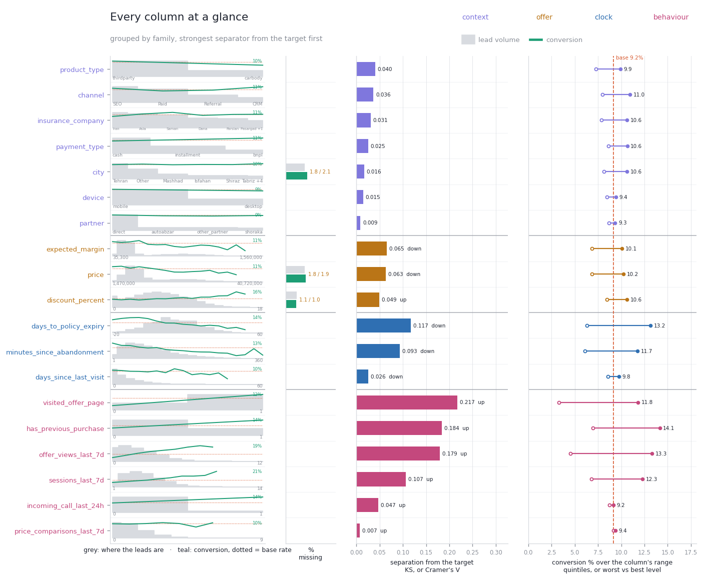

Where the leads are (grey) with conversion drawn through them (teal), then missingness,
separation from the target (KS / Cramér's V), and that separation in conversion points.
Densities would overlap at a 9% base rate and a correlation coefficient would ask the wrong
question of a 0/1 outcome — hence conversion drawn directly.

### Every pair

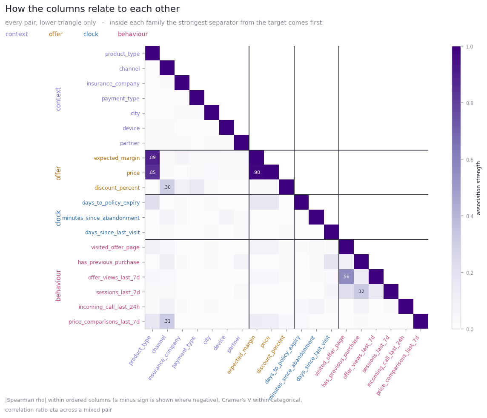

Spearman ρ for ordered × ordered, Cramér's V for categorical × categorical, η for mixed.

### Findings

- **The matrix is almost empty — that is the headline.** 171 pairs, median association
  **0.013**, only 7 above 0.25. Max separation from the target is **0.217**.
  → No deep interactions to find; no implausible lift, so nowhere for leakage to hide.
- **Three pairs are duplicates, not correlations.** `expected_margin ≈ price ×` a per-product
  constant (**0.984**); `product_type` explains both at **η 0.85** (carbody median price
  19.6M vs thirdparty 7.5M). One column written three ways.
- **A lead can buy without ever reaching the offer page.** 15,475 never reached it, **514
  bought anyway** (3.32% vs 11.79%). Among non-visitors: neither 2.6% · renewal 4.9% ·
  inbound call 4.2% · **both 8.6%**. `price` is present regardless, so the quote exists
  server-side.
- **The clock columns contradict their own names.** `minutes_since_abandonment` never reads 0
  and minute 360 holds **31×** the local density (a clip, not a range end).
  `days_to_policy_expiry` goes **negative** — 14.3% of leads, converting at **13.1% vs 8.5%**.
  `days_since_last_visit` stops dead at 60 with no nulls, so "never visited" is encoded nowhere.
- **`days_since_last_visit` associates with nothing — including what it must.** Every lead has
  `sessions_last_7d ≥ 1`, yet **36.4%** report a last visit older than 7 days, barely moving
  (39% → 30%) as sessions rise. The pair cannot both be true → the columns were drawn
  independently.
- **Missingness is not random.** `price` missing **3.5%** on Referral vs ~1.5% elsewhere.
- **Two columns carry nothing.** `price_comparisons_last_7d` moves conversion 9.1% → 9.6%
  across its whole range; `city` has 11 scattered levels (8.1%–10.6%, no order).

### And this is not one population

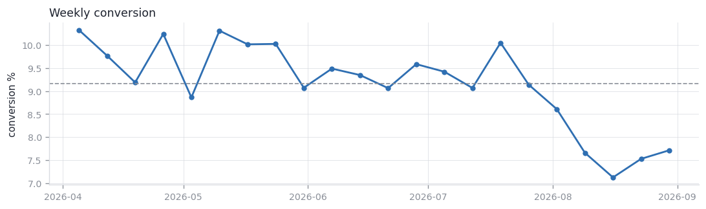

| Month | Leads | Conversion |
|---|---:|---:|
| 2026-04 | 10,081 | 9.76% |
| 2026-05 | 10,245 | 9.72% |
| 2026-06 | 9,840 | 9.49% |
| 2026-07 | 10,454 | 9.36% |
| **2026-08** | 9,380 | **7.38%** |

### Did the inputs move, or only the outcome?

April is the reference; each later month is compared back column by column, in **leads** —
the share that would have to change bin to look like April. Each cell carries its own
sampling-noise floor, and colour is value-over-floor, so only a real move takes colour.

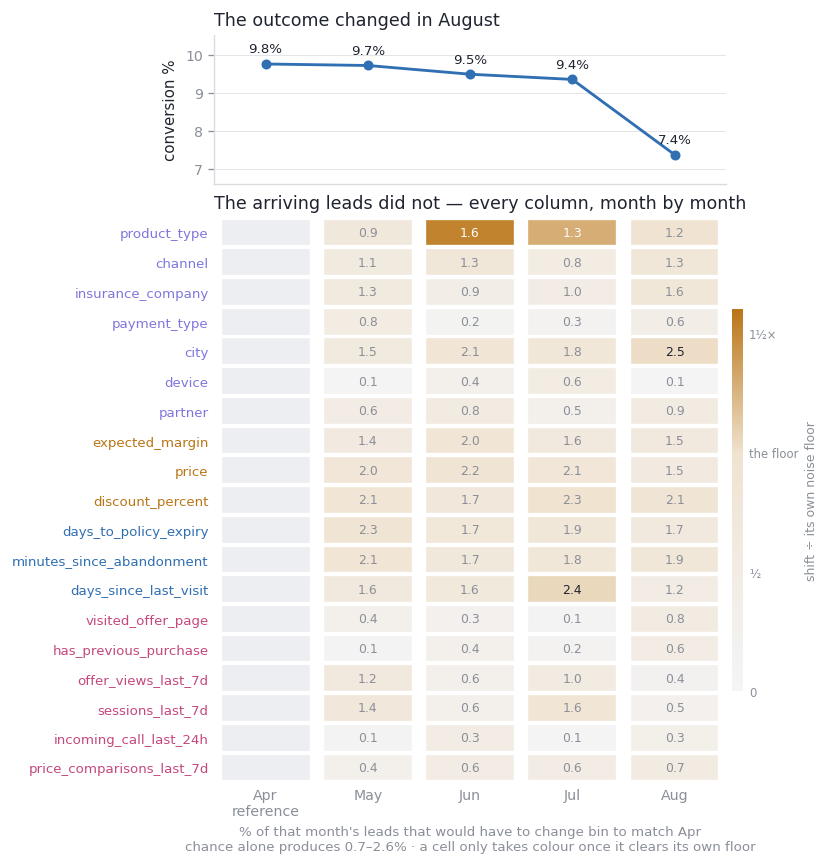

- **4 of 76 cells clear their floor — which is exactly what chance gives** at a
  95th-percentile floor. Worst cell anywhere is 1.52× its floor; no column twice in a row.
- Largest August move is 2.5% of leads (`city`); the one warm cell (`product_type`) moves
  1.5 points in May and back.

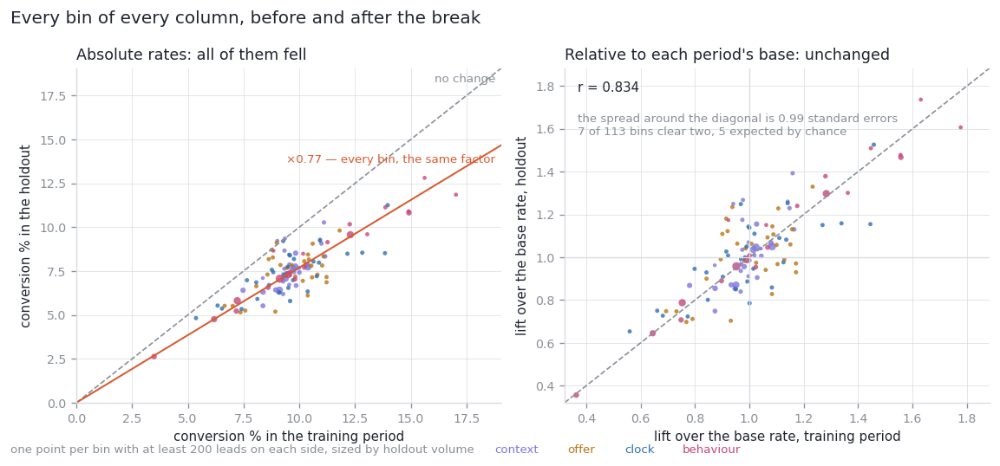

- **Every bin of every column converts worse by the same factor** — the panel sits on a
  **×0.77** line rather than scattering.
- Divided by each period's own base rate the bins land on the diagonal: **r 0.834** across
  113 bins, remaining spread **0.99 SE** — sampling noise.
- Largest mix effect: `visited_offer_page`, **−0.073pp of the −2.20pp** total.

**→ No covariate shift. This is concept shift** — the same leads converting less. Retraining
cannot recover the level, only recalibration can; and an input-drift alarm would never have
fired.

### Decisions

| Finding | Decision |
|---|---|
| 180 duplicate `lead_id`s, identical features | dedupe in `v_leads_curated`, keep the latest |
| associations near zero, max target separation 0.22 | accumulate weak signals; no leakage to exploit |
| behaviour columns barely associate with each other | synthetic-data artefact — re-test on production data |
| `expected_margin` = price × constant (0.98) | ranking **weight**, not a model input |
| `product_type` explains price (η 0.85) | drop raw `price`; use the **within-product percentile** |
| `visited_offer_page = 0` still buys | funnel depth, not a precondition — label is a *later* purchase |
| `minutes_since_abandonment` censored at 360 | re-infer inside 360 min, decay beyond |
| negative `days_to_policy_expiry` converts best | keep the sign, add `is_expired` |
| `days_since_last_visit` on its own clock | keep raw, never combine with session counts |
| `price` missing 3.5% on one channel | flag (`price_missing`), then impute **inside** `product_type` |
| `price_comparisons_last_7d`, `city` flat | excluded |
| conversion 9.5% → 7.4% in August | temporal split, newest 28 days held out |
| no column past its noise floor in any month | no covariate shift |
| mix effect ≤ 0.07pp of the −2.2pp move | concept shift — recalibrate, don't retrain-to-repair |
| lift per bin preserved (r 0.83, spread 0.99 SE) | rank the queue; re-measure calibration every run |

> **Caveat.** Part of the emptiness is the generator, not the domain: columns describing the
> same behaviour barely associate, where real traffic would move them together. "No
> interactions to find" is a fact about *this file* until re-tested on production data.

---

## 02 — What wrote a row

Two columns are timestamps and the serving path lives or dies on what they mean.

### `created_at` is a write stamp, not an event time

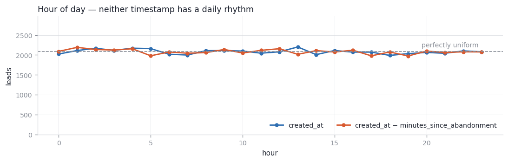

- Seconds always **`00`** (100%) · all 60 minute-of-hour values used · hour-of-day spread
  **CV 2.7%** · weekday **CV 2.4%** · ~333 rows/day, **CV 5.4%**.
- `corr(created_at, minutes_since_abandonment)` = **+0.0008**.
- Subtracting the age doesn't recover an event time either — the implied abandonment hour is
  equally flat (**CV 2.7%**). Real consumer traffic is never this uniform.

### The 180 duplicate ids say what the age column does *not* do

- 180 `lead_id`s appear twice; the **only** column that differs is `created_at` (gap 1–14 min,
  median 8).
- `minutes_since_abandonment` is **identical across the gap in 180 of 180 pairs**.

→ The age is **frozen at capture** and copied onto each write. The file therefore contains no
observation of a lead ageing — every row is one lead at one age.

### The age is censored at six hours, and carries real signal

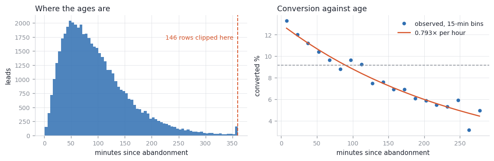

| Age (min) | Leads | Conversion |
|---|---:|---:|
| 0–60 | 16,507 | 11.27% |
| 60–120 | 19,334 | 9.30% |
| 120–180 | 9,201 | 7.23% |
| 180–240 | 3,385 | 5.73% |
| 240–300 | 1,080 | 4.26% |
| 300–359 | 347 | 4.90% |
| **exactly 360** | 146 | **2.74%** |

- Smooth **0.793×/hour** on the rate scale, **0.778×/hour on the odds scale** — which is where
  `priority.decay_per_hour` comes from (the queue multiplies a probability, so odds is the
  right scale).
- Controlling for **every other feature** moves it only 0.778× → **0.770×/h**, and nothing
  correlates with age past ±0.07. So the decline is not "older leads are worse leads".
- What it cannot rule out: **survivor composition** — keen buyers leave by buying. One
  snapshot per lead makes that indistinguishable from cooling → the decay is an **upper bound**.

### At inference

```sql
age_now = LEAST(minutes_since_abandonment + (now − created_at), 360)
```

With the clock pinned to the dataset: 48 leads (0.10%) inside support · 260 (0.52%) past
support but inside the 24h horizon · 49,692 (99.38%) out of the queue. On a wall clock the
median lead would be **89 days old** — hence `priority.current_time`.

### Decisions

| Decision | Why |
|---|---|
| `minutes_since_abandonment` **is** a feature | monotone 11.3% → 4.9%, survives every control |
| `created_at` is **not** a feature | a scheduling artefact — feeding it in fits the export job |
| age = `minutes + (now − created_at)`, capped at 360 | the only reading the evidence allows |
| re-infer inside support, decay outside | outside, every training row was censored to the boundary |
| decay is a **ranking device**, not a probability | fitted across leads, never along one lead |
| decay only the time **past** the boundary | the model already priced the age it was handed |
| both clocks advance together (`advance_clock`) | moving one invents a lead that aged while the calendar stood still |
| dedupe on `lead_id`, keep the newest write | the newest stamp is what makes `now − created_at` right |
| `priority.current_time` pins "now" | a fixed export on a live clock puts every lead past its support |
| newest 28 days held out | the label is a *later* purchase, so a fresh row's outcome isn't final |

---

## 03 — Split and model selection

### The market moved while we were measuring it


| Window | Rows | Period | Base rate |
|---|---:|---|---:|
| train | 31,204 | Apr 01 → Jul 03 | 9.63% |
| validation | 9,416 | Jul 04 → Jul 31 | 9.42% |
| holdout | 9,380 | Aug 01 → Aug 28 | **7.38%** (−23%) |

- **Three jobs, three windows.** Train fits · **validation chooses the algorithm** · holdout is
  read **exactly once**, afterwards.
- Choosing on the window you then quote is selection-on-test — small with four candidates, but
  **it is the structure that leaks, not the count**.
- A random split would put August rows on both sides and report a score the model cannot reproduce.
- The newest 28 days also absorb the assumed **7-day attribution window**.

### Six candidates, one validation window


| Candidate | PR-AUC | ROC-AUC | Brier |
|---|---:|---:|---:|
| **logreg** ✅ | **0.2054** | 0.7098 | 0.2182 |
| rf | 0.1904 | 0.7040 | 0.1877 |
| extratrees | 0.1862 | 0.6941 | 0.2109 |
| gbdt | 0.1855 | 0.6900 | 0.2000 |
| rule of thumb | 0.1485 | 0.6667 | 0.8041 |
| random order | 0.0946 | 0.5038 | 0.3304 |

- **The linear model wins by ~8%**, against the usual "boosting wins on tabular data".
- **Not a tuning artefact:** a 20-point sweep over `min_samples_leaf` (5–200) × `max_features`
  left the whole bagged-tree family between **0.18 and 0.19**.
- It follows from 01: strongest pairwise association 0.25, strongest target separation 0.22 →
  no deep interactions, so extra capacity buys variance. The two that *do* matter
  (`is_expired`, `expiry_x_abandonment`) are handed to **every** candidate as engineered features.
- The hand-written rule (4 binary conditions) is a respectable baseline — beating *that* is the
  honest measure of what modelling bought.
- → `train.candidates = [logreg]` in production. Re-open the notebook when the data changes.

### Refit, then calibrate

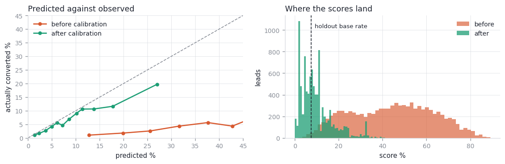

- Once the algorithm is fixed, validation is worth more as **training data** than as a referee →
  refit on train + validation.
- `class_weight="balanced"` is right for ranking but inflates raw probabilities ~3×. Harmless for
  order, serious for a queue that multiplies probability by margin.
- **Isotonic regression:** mean score **44.19% → 9.58%** (observed 7.38%), Brier **0.2209 →
  0.0667**, PR-AUC 0.1579 → 0.1540 (rank-based, so ~unchanged).
- **Caveat:** the calibrator is fitted on a ~9.6% regime while the holdout converted at 7.4%.
  July was 9.4%, so widening the fit doesn't rescue it → the score distribution is recorded every
  run and recalibration is expected.

> Notebook 03's own refit reports holdout PR-AUC 0.154 and 2.98× lift at 250 calls; the
> registered production model in the headline table reports 0.157 and 3.31×. Same code path,
> separate fit — read the notebook figures as the notebook's, not as a second measurement of the
> same artifact.

---

## 04 — Serving and decay

Stored features never change, so a blanket rescore returns identical numbers. What changes is
**age** — and past 360 minutes the model has no evidence.

### Two regimes


- **Inside 360 min** — the scoring job advances the clock and **re-infers**. Exact, and finite
  per lead: the work winds itself down.
- **Past the boundary** — the last defensible answer becomes an anchor that `v_current_priority`
  decays in SQL at **×0.778/hour, when the queue is read**.
- The decay applies **only to the time past** the boundary, and leads past the horizon **leave**
  the queue rather than decaying toward zero inside it.

### How wrong is the decay?

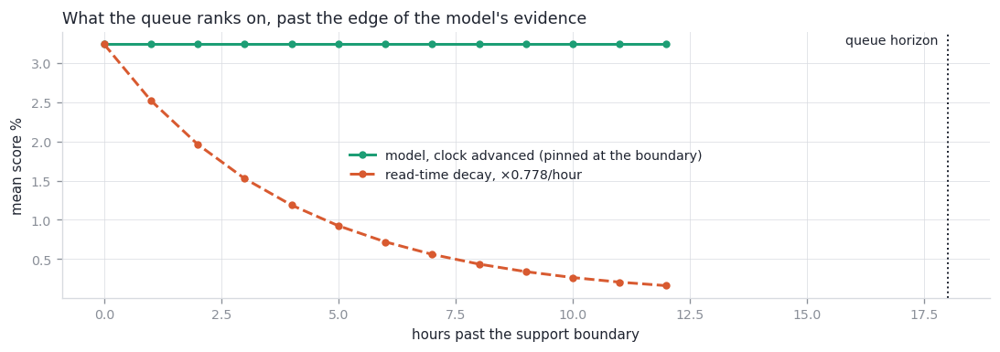

| Hours past boundary | Decayed | Model (re-inferred) |
|---:|---:|---:|
| 0 | 3.24% | 3.24% |
| 3 | 1.53% | 3.24% |
| 6 | 0.72% | 3.24% |
| 12 | 0.16% | 3.24% |

- **The flat line is the point.** Past the boundary every input has stopped moving, so the model
  just repeats the boundary value forever. Re-inference out there isn't expensive — it has
  nothing left to say.
- Agreement with re-inference: **mean gap 0.6pp · Spearman 0.97 · 84% overlap in the top 5%**.

### Where the queue ends

| Total age | Best lead | Median lead | Above 1% |
|---:|---:|---:|---:|
| 6h | 22.58% | 2.231% | 75.2% |
| 12h | 6.08% | 0.503% | 30.5% |
| 18h | 1.41% | 0.112% | 0.3% |
| **24h** | 0.32% | 0.025% | **0.0%** |
| 48h | 0.00% | 0.000% | 0.0% |

- Floor is **1%**, about a tenth of the base rate — a stated choice, since the data has no
  call-cost column to derive one from.
- By ~20h the best lead left is under 1%; by 24h the whole queue is under 0.5%.
- → **Horizon = 24 hours** (was 48h — dead rows diluting the P1…P4 percentile cut-offs), and
  `decay_max_excess_hours = 18` (horizon minus support) so the cap never binds on a queued lead.
- Since the decay is an upper bound, **24h is the optimistic end**.

### The serving path

| Step | Where | What it does |
|---|---|---|
| every 5 min | `predict.run()` | finds leads whose age has outrun their last score, inside 360 min |
| | `advance_clock()` | moves both clocks — abandonment up, expiry down |
| | model | re-infers; exact for that age |
| | `predictions` | stores the score **and the age it was scored at** |
| on read | `v_current_priority` | decays the anchor past the boundary, drops leads past 24h |
| every run | `monitoring_snapshots` | records the score distribution, so drift is visible |

`scored_at_age_minutes` is what makes this self-limiting — it tells the next run whether a lead
still needs work.

---

## 05 — Interpretation

Both answers are **model-agnostic**, so switching algorithms costs nothing but the equation.

### Globally: permutation importance

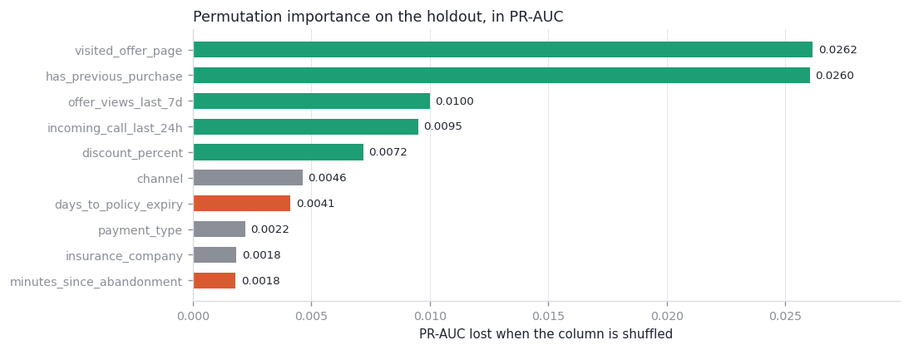

| Feature | PR-AUC lost | Direction |
|---|---:|---|
| visited_offer_page | 0.0262 | up |
| has_previous_purchase | 0.0260 | up |
| offer_views_last_7d | 0.0100 | up |
| incoming_call_last_24h | 0.0095 | up |
| discount_percent | 0.0072 | up |
| channel | 0.0046 | categorical |
| days_to_policy_expiry | 0.0041 | down |

- **No single feature dominates** — the top two are worth a few thousandths of PR-AUC each.
- That is not a weak model; it is an accurate description of the problem. A feature with
  implausible importance here would be the first place to look for leakage.

### Per lead: one-at-a-time ablation


- Set one feature to the **population reference**, re-score, and the shift in log-odds is what
  that lead's own value contributed. Example lead: baseline 7.76% → **39.81%**.
- **Deliberately not a Shapley value.** One-at-a-time ablation cannot capture interactions, and
  the calibration layer is monotone but not linear, so the parts do not sum to the whole. The gap
  is printed as a **`residual`** (+1.20 log-odds for that lead) rather than quietly distributed —
  and a large residual is itself the finding.
- It earned itself immediately: it showed raw `price` carrying a large contribution, contradicting
  the documented decision to use only the within-product percentile. Measured head to head the raw
  column moved PR-AUC not at all → removed.

### Response curves: what would change this score?

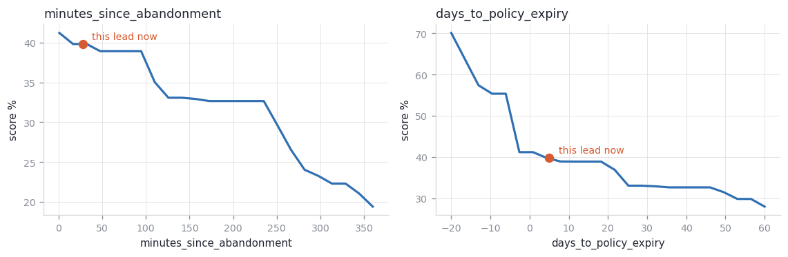

One lead held fixed, one feature swept across the trained range. The abandonment curve **stops at
360** — sweeping past it would produce a line, but not evidence.

### The limit interpretation cannot fix

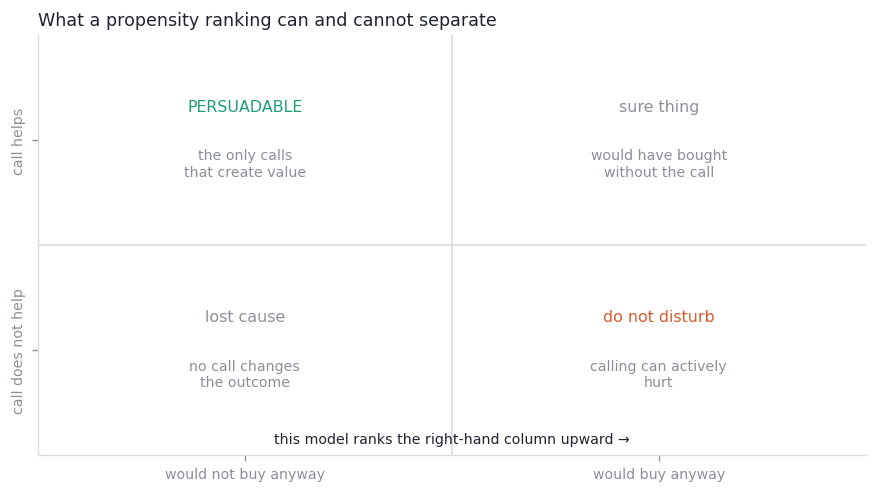

- Everything above explains **who is likely to buy**. The floor wants **who buys *because we
  called***.
- **There is no outbound-call column.** `incoming_call_last_24h` is *inbound* — the customer's
  intent, not our treatment. A model cannot estimate the effect of an action it has never observed.
- Ranking by propensity pushes the whole right-hand column up the queue, including the sure things
  where the call was never needed, and cannot see the bottom-right quadrant at all.
- **The fix is data, not modelling:** withhold calls from a small random slice of the queue.
  Highest-value next step.

---

## Who the leads are

k-means over the model's own feature space, k chosen by **silhouette**, PCA only for the plot,
recomputed with each model version.

| Segment | Leads | Converts | Avg margin | Of its queued leads, we'd call |
|---|---:|---:|---:|---:|
| policy already expired | 6,991 | 13.2% | 281K | 18% |
| reached the offer page | 23,744 | 12.1% | 338K | 29% |
| average across the board | 928 | 9.6% | 351K | 38% |
| stale, far from expiry | 7,010 | 5.1% | 408K | 8% |
| never saw an offer | 11,327 | 3.1% | 400K | 7% |

The first row is the interesting one: it converts best of any group yet takes fewer calls than the
offer-page group, because it carries the **lowest** margin. That is expected-value ranking working
as intended — ranking on probability alone would invert the two.

---

## Techniques used

| Area | Technique | Where |
|---|---|---|
| Univariate signal | conversion-through-density, KS statistic, Cramér's V | 01 |
| Pairwise structure | Spearman ρ, Cramér's V, correlation ratio η | 01 |
| Drift | PSI + total-variation distance per column, each against a **Monte-Carlo null** (400 multinomial re-draws from the pooled distribution) as its own noise floor; mix-effect decomposition; per-bin lift stability with z-scores | 01 |
| Record forensics | uniformity / CV tests on timestamps, duplicate-pair diffing, censoring detection by density spike | 02 |
| Decay estimation | log-linear fit of conversion on age, rate **and** odds scale, with and without controls | 02 |
| Feature engineering | within-product price percentile, missingness flags, product-wise median imputation, `is_expired`, `expiry_x_abandonment`; population reference frozen into the artifact | `features.py` |
| Encoding | one-hot with `min_frequency=20` + `handle_unknown="ignore"`, standard scaling | `features.py` |
| Imbalance | `class_weight="balanced"` / `balanced_subsample` | `features.py` |
| Model families | logistic regression · HistGradientBoosting · RandomForest · ExtraTrees | 03 |
| Baselines | 4-condition hand-written rule · random order | 03 |
| Validation | three-way **temporal** split; select on validation, refit on train+validation, quote the holdout once | 03 |
| Tuning | 20-point grid over `min_samples_leaf` × `max_features` (bagged-tree family) | 03 |
| Metrics | PR-AUC (headline) · ROC-AUC · Brier · precision/recall/lift/margin-capture @ k · gains curve · calibration curve | `metrics.py` |
| Calibration | isotonic regression | 03 |
| Serving | clock advance + re-inference inside support; exponential odds decay in SQL past it | 04 |
| Interpretation | permutation importance (PR-AUC) · one-at-a-time ablation with explicit residual · per-lead response curves | 05 |
| Segmentation | k-means, k by silhouette, PCA for display only | `segments.py` |

---

## Assumptions

| # | Assumption | Evidence / status |
|---|---|---|
| 1 | **A row is a snapshot of a priced quote, written by a scheduled job.** `created_at` is the write stamp; `minutes_since_abandonment` is the age at capture, frozen. | Seconds always `00`, flat by hour/weekday, +0.0008 with age; 180/180 duplicate pairs share an identical age across a 1–14 min gap (02) |
| 2 | **`completed_purchase` is a later purchase, not this session's**, backfilled afterwards. | 514 buyers never reached the offer page (01) |
| 3 | **The age is right-censored at 360 minutes**, not merely bounded. | Minute 360 holds 31× the local density (01, 02) |
| 4 | **The model has no evidence past 360 min**, so anything beyond is a ranking device. | Re-inference past the boundary returns a flat line (04) |
| 5 | **The decay constant is an upper bound** — cooling cannot be separated from survivor composition. | One snapshot per lead; the file never watches one lead age (02) |
| 6 | **Attribution window ≈ 7 days**, absorbed by holding out the newest 28 days. | Stated assumption, not derivable from the export (02, 03) |
| 7 | **The 1% call-worth floor** setting the 24h horizon is a stated choice. | No call-cost column exists to derive one (04) |
| 8 | **The within-product price percentile is a judgement call** — a premium insurer looks like an overpriced cheap one. | Kept; first feature to re-test if the queue looks product- or company-skewed (01) |
| 9 | **"Now" is pinned** (`priority.current_time`) because the export is a fixed 5-month file. | Wall clock would put the median lead 89 days past support (02) |
| 10 | **Several findings are properties of a synthetic file, not the business** — independent behaviour columns, clocks that contradict their names. | Taken at face value, flagged where they appear; re-test on production data (01, 02) |

---

## Limits

- **This ranks propensity, not uplift.** No outbound-call column exists. Separating them needs a
  randomized call holdout — the highest-value next step.
- **The decay is an upper bound.** One snapshot per lead.
- **Probabilities will drift.** Trained on a 9.5% period, scoring a 7.4% one. Recalibration is
  expected; the *ranking* holds up far better than the levels.
- **The read-time decay approximates the model** past the boundary (mean gap 0.6pp, Spearman 0.97,
  84% top-5% overlap). Inside the support nothing is approximated.
- **The dataset is a fixed 5-month export**, so "now" is pinned and the panel says so.
- **"No interactions to find" is about this file.** Re-test before believing it about the domain.

---

## Under the hood

```
config/config.yaml           every tunable; overridable by PE_<SECTION>__<KEY>
db/migrations/*.sql          schema + indexes, applied idempotently at start-up
src/priority_engine/
  config · db · ingest       yaml + env, engine/migrations/queries, CSV -> Postgres
  features · train · metrics feature build + models, split/select/calibrate, PR-AUC & lift
  predict · interpret        scoring + decay, importance/attribution/response curves
  segments · scheduler · api k-means, the two cron jobs, FastAPI
notebooks/                   the exploration behind every decision above
charts/                      the same figures as PNGs, written by the notebooks
```

**Data flow.** The CSV is read once, at boot. Everything after that reads Postgres: `leads` (raw
and lossless — `lead_id` is deliberately not unique) → `v_leads_curated` (freshest row per lead,
what every consumer reads) → `predictions` (append-only) → `v_current_priority` (the live call
list, decay and tiers applied on read). `model_versions` holds one row per training run — holdout
metrics, validation metrics, the candidate comparison, feature spec, artifact — with a unique
partial index so exactly one model is ever active. `job_runs` and `monitoring_snapshots` carry job
history and drift.

**Jobs** (APScheduler, in the `worker` container): training monthly, plus at startup if no model is
registered; prediction every 5 minutes, walking leads through the support window.

**Configuration.** `config/config.yaml`, any value overridable by env var:

```bash
PE_TRAIN__HOLDOUT_DAYS=14
PE_PRIORITY__QUEUE_HORIZON_HOURS=12
PE_PRIORITY__CURRENT_TIME=2026-08-20T12:00:00Z   # or `dataset`, or empty for the real clock
```

`priority.current_time` decides what "now" means for the whole queue: `dataset` (the newest
`created_at` — the default on this export), an explicit instant for replaying a moment, or empty
for the wall clock. `GET /api/clock` reports the resolved instant and whether it is pinned. DB
credentials come from `POSTGRES_*` only and never live in the YAML.

---

## The panel

Three sections: **Dashboard** (overview, model, segments, monitoring — four tabs, each with its own
URL), **Call queue** (who to call, filterable, with a per-lead explanation panel beside it), and
**How it works** (the case in eight slides, one claim and one live chart each).

Every figure there is generated from Postgres at request time — code-generated, never hand-made,
never stale. The static counterparts live in `charts/`, written by the notebooks from the same code
path.

### Proving it live

The backtest slides prove the ranking *would have* worked — every one of those leads was still
called the old way. Whether reps calling *from the ranking* sell more is a causal question, and it
takes an A/B test:

1. **Split live traffic, not historical rows** — randomize at the *lead* level across arms
   (control / heuristic / model), so no rep works two arms on the same lead.
2. **Pick one primary metric up front** — conversion within the arm's call window, fixed before the
   test starts. Secondaries get reported, not decided on.
3. **Size the sample before starting** — a two-proportion z-test power calculation (80% power,
   α = 0.05) from the ≈7–9% base rate and the smallest lift worth acting on. Not "run it until it
   looks good."
4. **Read it once**, at the pre-registered stopping point — report the 95% CI on the difference and
   require it to exclude zero. Peeking daily is how noise gets sold as lift.
5. **Re-run, don't reuse** — a win expires the same way the backtest does.

The last slide walks these five steps next to a template chart — **illustrative numbers only, no
experiment has run yet.**

---

## Notebooks

```bash
docker compose up -d postgres     # then load-data once, if the table is empty
pip install -r requirements.txt
jupyter lab notebooks/
```

Run in order the first time: `03` fits the model and writes `artifacts/notebook_model.joblib`,
which `04` and `05` load instead of refitting. Figures are written to `charts/` as PNGs.
`pe_style.py` holds the shared palette, figure defaults, the column taxonomy and the EDA figures —
and every figure returns the numbers behind it as a DataFrame, which is what the findings cells
read, so the prose and the pictures cannot drift apart.

Nothing in the pipeline imports the notebooks; the dependency runs the other way.
`pe_style` defaults to `localhost:5433`; override with `POSTGRES_HOST` / `POSTGRES_PORT` /
`POSTGRES_PASSWORD`.
